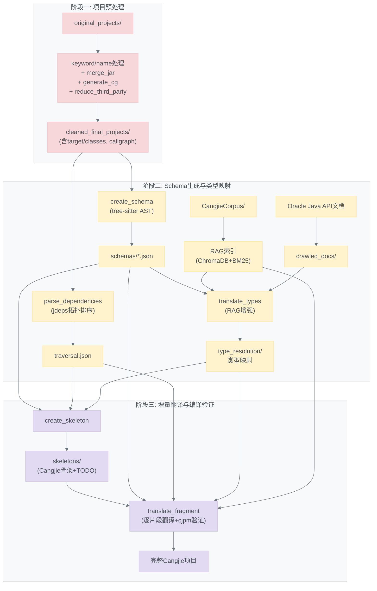

---

一、关键字冲突处理 (handle_keyword_conflicts)

需要处理的冲突关键字

仓颉有但 Java 中可作为标识符的关键字：type、init、in、is、func、match

class、return、if 等两边都是关键字的直接跳过，因为 Java  
中本来就不能用作标识符。

两阶段处理流程

Phase 1：预扫描 (pre_scan_project)

遍历所有 Java 文件，用 tree-sitter 解析 AST，收集三个关键信息：

┌───────────────────────────┬────────────────────┬─────────────────────────┐  
│ 收集项 │ 变量名 │ 用途 │
├───────────────────────────┼────────────────────┼─────────────────────────┤  
│ 用户自定义类名 │ user_classes │ 判断引用是 JDK │
│ │ │ 类还是用户类 │
├───────────────────────────┼────────────────────┼─────────────────────────┤  
│ 文件中声明的关键字标识符 │ file_decls │ 判断 bare name 引用是不 │
│ │ │ 是继承来的外部字段 │  
├───────────────────────────┼────────────────────┼─────────────────────────┤
│ 项目中以关键字命名的方法 │ project_method_dec │ 避免误改外部库方法调用 │  
│ 声明 │ ls │ │
└───────────────────────────┴────────────────────┴─────────────────────────┘

Phase 2：逐文件 AST 级替换

对每个 Java 文件，遍历 AST 中的 identifier / type_identifier  
节点，找到名字命中的关键字，通过 _get_identifier_context
判断上下文决定重命名策略：

┌────────────────────────────────────┬──────┬───────────────────────┐  
│ 上下文 │ 前缀 │ 示例 │
├────────────────────────────────────┼──────┼───────────────────────┤  
│ 方法声明 / 方法调用 │ _ │ is() → is_() │
├────────────────────────────────────┼──────┼───────────────────────┤  
│ 字段声明、字段访问、参数、局部变量 │ __ │ int type → int type__ │  
└────────────────────────────────────┴──────┴───────────────────────┘

关键是避免误改外部引用：

1. JDK 类引用：System.in、Option.builder().type() — 通过 _is_jdk_class_ref  
   检查接收者是大写开头且不在 user_classes 中，直接跳过
2. 外部库方法调用：如 javax.crypto.Mac 实例的 mac.init() — 检查方法名是否在  
   project_method_decls 中出现过，不在则跳过
3. 继承字段：如 FilterInputStream.in — 检查 name 是否在本文件的 file_decls
   中，不在则认为继承自外部，跳过

二、内部类命名冲突处理 (handle_name_conflicts)

核心问题

Java 有内部类，但仓颉没有。翻译时要将内部类提取为顶层类，因此需要重命名避免冲突
。策略是 OuterClass_InnerClass 格式。

三步流程

Step 1：收集所有顶层类名和继承关系

遍历所有 Java 文件，用 tree-sitter AST 收集：

- 所有顶层类名 → all_names（用于后续冲突检测）
- 每个文件的 extends/implements 关系 →  
  file_extends（用于处理通过继承访问的内部类引用）

Step 2：检测所有内部类

递归遍历 AST，找到嵌套深度 > 0 的 class_declaration /  
interface_declaration，记录 {name, outer_class_name}。

Step 3：解析名称并全局替换

- 默认名 OuterClass_InnerClass
- 如果与已存在名称冲突，追加后缀 _2、_3...
- 对每个内部类，在整个项目中执行三种模式的替换：

┌──────────┬────────────────────────────────────────┬─────────────────────┐  
│ 模式 │ 正则 │ 示例 │  
├──────────┼────────────────────────────────────────┼─────────────────────┤  
│ 限定引用 │ OuterClass.InnerClass → │ Foo.Bar → │
│ │ OuterClass.NewName │ Foo.Foo_Bar │  
├──────────┼────────────────────────────────────────┼─────────────────────┤  
│ .new │ .new InnerClass → .new NewName │ │
│ 构造 │ │ │  
├──────────┼────────────────────────────────────────┼─────────────────────┤
│ 裸引用 │ \bInnerClass\b → NewName │ │  
└──────────┴────────────────────────────────────────┴─────────────────────┘

裸引用的替换有范围限制，只在以下文件中替换：

- 定义文件（内部类所在的文件）
- 有 qualified 引用的文件（通过 import 或全限定名引用）
- 子类文件（通过 extends 继承了该内部类所在的外层类）

---

总结：关键字冲突处理是词法层面的（改后缀），关键难点在于区分需要改的项目内引用
和不能改的 JDK/外部库引用；内部类冲突处理是名称层面的（改类名），关键难点在于要
全局一致地替换所有引用点，同时通过继承关系覆盖子类中的裸引用。

RAG 系统分为 离线构建（一次性） 和 在线检索（每次翻译时） 两大阶段，由 5  
个模块协同工作。

---

架构总览

                      ┌──────────────┐
                      │  RagEngine   │  ← 统一入口（单例模式）
                      │  __init__.py │
                      └──────┬───────┘
             ┌───────────────┼───────────────┐
             │               │               │
      ┌──────▼──────┐ ┌──────▼──────┐ ┌──────▼──────┐
      │QueryBuilder │ │  Retriever  │ │  Injector   │
      │  查询构建    │ │  混合检索   │ │  格式化注入  │
      └─────────────┘ └──────┬──────┘ └─────────────┘
                      ┌──────┴──────┐
                      │   Indexer   │ ← 离线构建索引
                      │  一次调用   │
                      └──────┬──────┘
                      ┌──────┴──────┐
                      │CorpusLoader │ ← 文档分块 + 去重
                      └─────────────┘


---

阶段一：离线构建索引 (indexer.py + corpus_loader.py)

Step 1 — 文档扫描与分块 (CorpusLoader)

输入：misc/CangjieCorpus/ 目录下的所有 .md  
文档（仓颉语言手册、标准库、扩展库、工具链文档等）

分块策略：以 ##（二级标题）为分割点，每个 ## 段及其下的 ### 子内容组成一个  
Chunk。

关键机制：

- 代码块保护：通过追踪 ``` 围栏状态，确保分割不会把代码块切碎
- 标题链注入：每个 Chunk 的内容前会加上 [Context: h1 > h2 > h3] 前缀，让 chunk
  在脱离原文后仍有上下文定位能力
- 元数据记录：每个 Chunk 记录 path（源文件路径）、category（manual/std/stdx/ext
  ra/tools）、language（zh/en）、title_chain

去重（两层）：

1. 精确去重：内容 SHA256 → _seen_hashes 集合
2. 近似去重：MinHash + LSH（Locality-Sensitive Hashing），128 个哈希函数，阈值
   0.85，过滤内容高度相似的 chunk

Step 2 — 向量嵌入 (Indexer._embed_chunks)

对去重后的所有 Chunk 调用 OpenAI text-embedding-3-large 生成 1536 维向量：

- 批次大小 20，批间延迟 0.5s 限速
- 失败自动重试一次（间隔 5s）
- 重试仍失败则 embedding 置 None，该 chunk 仅参与 BM25 检索

Step 3 — 存储 ChromaDB (Indexer._store_chromadb)

- 使用 ChromaDB PersistentClient，HNSW 索引，cosine 相似度
- Collection 名 cangjie_corpus_v1，每次构建先删除再重建
- 存储：id、embedding、metadata、document（原文）

Step 4 — 构建 BM25 (Indexer._build_bm25)

- 所有 chunk 的 content 转小写、按空格分词
- 用 rank_bm25 库的 BM25Okapi 构建稀疏索引
- 将 (bm25对象, chunks列表) pickle 序列化保存

---

阶段二：在线检索与注入

由 RagEngine 统一调度，提供三种场景的接口：

场景 A：类型翻译 (inject_type_context)

流程：

1. QueryBuilder.build_type_query：输入 HashMap<K,V> → 提取基础类型 HashMap →
   查术语映射表 → 生成查询 "仓颉 HashMap 映射 类型 如何使用"
2. Retriever.search(query, top_k=2)：混合检索取得分最高的 2 个 chunk
3. Injector.format_for_type_resolution：排序 + 格式化，包装为带说明的 Markdown
   prompt 片段

场景 B：代码片段翻译 (inject_fragment_context)

流程：

1. QueryBuilder.build_fragment_query：从 Java 代码片段中提取：- 类型名（大写开头的词 + 泛型模式 Foo<）  
   - API 调用（ClassName.methodName 模式）- Java 关键字（instanceof、synchronized、extends 等）  
   - 所有提取的术语通过 java_cangjie_terms.yaml 映射为仓颉术语  
   - 去重后拼接为 "仓颉 <terms> 语法 示例"
2. Retriever.search(query, top_k=3)
3. Injector.format_for_fragment_translation：包装为 "### Reference Cangjie  
   documentation:" 格式

场景 C：编译错误反馈 (inject_error_context)

当翻译结果编译失败需要重试时：

1. QueryBuilder.build_error_query：从 cjc 编译错误中提取：- 错误类型（error: XXXX 模式）  
   - 标识符名（'foo' 引号包围的词）- 生成查询 "仓颉 <error_type> <identifiers> 错误 修复"
2. Retriever.search(query, top_k=3)
3. Injector.format_for_error_feedback：包装为 "### Corrective Reference:"  
   格式，说明上次翻译编译失败，提供纠正性文档

---

核心检索算法：混合检索 + RRF 融合 (retriever.py)

每次 search() 调用并行执行两个独立检索：

向量检索（语义匹配）

- 将查询文本用 text-embedding-3-large（与离线索引同模型同维度）生成向量
- 在 ChromaDB 中以 cosine 相似度取 top-10

BM25 检索（关键词匹配）

- 查询文本分词后，对 pickle 中的 BM25 索引计算分数
- 取分 > 0 的 top-10

RRF 融合（Reciprocal Rank Fusion）

公式：score(d) = 1/(60 + rank_vector(d)) + 1/(60 + rank_bm25(d))

- K=60 是经典经验值
- 两个列表中排名都靠前的文档获得最高分
- 只在一个列表中出现的文档仍有机会被选中（但得分偏低）

后处理

- 按 category 排序：manual > std > stdx > tools > ohos > extra >  
  other（优先展示语言手册和标准库定义）
- 同类别按 title_chain 排序
- 按 path|h2 去重：避免同一来源的多个子段重复出现

---

术语映射 (query_builder.py + java_cangjie_terms.yaml)

核心 java_cangjie_terms.yaml 维护了 Java → 仓颉术语的一对多映射：

┌──────────────┬──────────────────────┐
│ Java 术语 │ 仓颉搜索词 │  
├──────────────┼──────────────────────┤
│ Optional │ Option、可选 │
├──────────────┼──────────────────────┤
│ Stream │ 流、Iterator、迭代器 │
├──────────────┼──────────────────────┤  
│ Map │ HashMap、映射 │
├──────────────┼──────────────────────┤  
│ synchronized │ 同步、锁 │
└──────────────┴──────────────────────┘

这样即使是英文仓颉文档，也能通过中文术语命中；中文手册通过英文等价词也能命中。

---

注入格式化 (injector.py)

最终注入到 LLM Prompt 的格式，以类型翻译为例：

### Reference: Cangjie documentation

The following documentation from Cangjie standard library may help:
---

### Reference [Source: Standard Library]

[Context: 集合类型 > HashMap > 基本用法]  
HashMap 是仓颉标准库提供的键值对映射类型...

### Reference [Source: Language Manual]

[Context: 类型系统 > 泛型]  
仓颉支持泛型类型参数...
---

Chunk 按 category 优先级排序，确保语言规范（manual）的定义优先于扩展库参考。

---

调用入口 (**init**.py)

整个模块对外暴露为 模块级单例：

rag = get_rag_engine() # 首次调用自动检查/构建索引  
context = rag.inject_fragment_context(java_code) # 返回 str | None

ensure_index() 在首次调用时检查 bm25_index.pkl 是否存在，不存在则自动触发  
Indexer.build() 全量构建。

---

总结：这个 RAG 系统的核心设计思想是 离线高性能索引 + 在线语义-关键词混合检索 +
RRF 融合重排序。离线阶段用 MinHash 去重保证索引质量，在线阶段用术语映射桥接  
Java 到仓颉的概念差异，最终通过优先级排序将最相关的仓颉文档注入 LLM Prompt。
