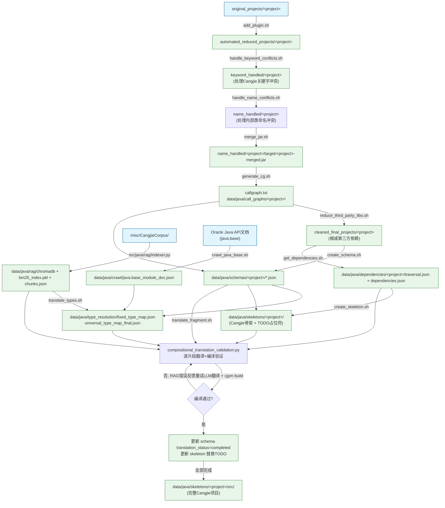

```mermaid
flowchart TD
    A1["original_projects/&lt;project&gt;"] -->|add_plugin.sh| A2["automated_reduced_projects/&lt;project&gt;"]
    A2 -->|handle_keyword_conflicts.sh| A3["keyword_handled/&lt;project&gt;<br/>(处理Cangjie关键字冲突)"]
    A3 -->|handle_name_conflicts.sh| A3b["name_handled/&lt;project&gt;<br/>(处理内部类命名冲突)"]
    A3b -->|merge_jar.sh| A4["name_handled/&lt;project&gt;/target/&lt;project&gt;-merged.jar"]
    A4 -->|generate_cg.sh| A5["callgraph.txt<br/>data/java/call_graphs/&lt;project&gt;/"]
    A5 -->|reduce_third_party_libs.sh| A6["cleaned_final_projects/&lt;project&gt;<br/>(缩减第三方依赖)"]
    A6 -->|create_schema.sh| C1["data/java/schemas/&lt;project&gt;/*.json"]
    A5 --> C1
    A6 -->|get_dependencies.sh| C2["data/java/dependencies/&lt;project&gt;/traversal.json + dependencies.json"]
    D1["misc/CangjieCorpus/"] -->|src/java/rag/indexer.py| D2["data/java/rag/chromadb + bm25_index.pkl + chunks.json"]
    D3["Oracle Java API文档<br/>(java.base)"] -->|crawl_java_base.sh| D4["data/java/crawl/java.base_module_doc.json"]
    D2 -->|translate_types.sh| E1["data/java/type_resolution/fixed_type_map.json<br/>universal_type_map_final.json"]
    D4 --> E1
    C1 --> E1
    C1 --> E2
    C2 -->|create_skeleton.sh| E2["data/java/skeletons/&lt;project&gt;/<br/>(Cangjie骨架 + TODO占位符)"]
    C1 -->|translate_fragment.sh| F1["compositional_translation_validation.py<br/>逐片段翻译+编译验证"]
    C2 --> F1
    E1 --> F1
    E2 --> F1
    D2 --> F1
    F1 -->|LLM翻译 + cjpm build| F2{"编译通过?"}
    F2 -->|否, RAG错误反馈重试| F1
    F2 -->|是| F3["更新 schema translation_status=completed<br/>更新 skeleton 替换TODO"]
    F3 -->|全部完成| F4["data/java/skeletons/&lt;project&gt;/src/<br/>(完整Cangjie项目)"]

    classDef input fill:#e1f5fe,stroke:#01579b
    classDef output fill:#e8f5e9,stroke:#2e7d32

    class A1,D1,D3 input
    class A2,A3,A4,A5,A6,C1,C2,D2,D4,E1,E2,F3,F4 output
```
