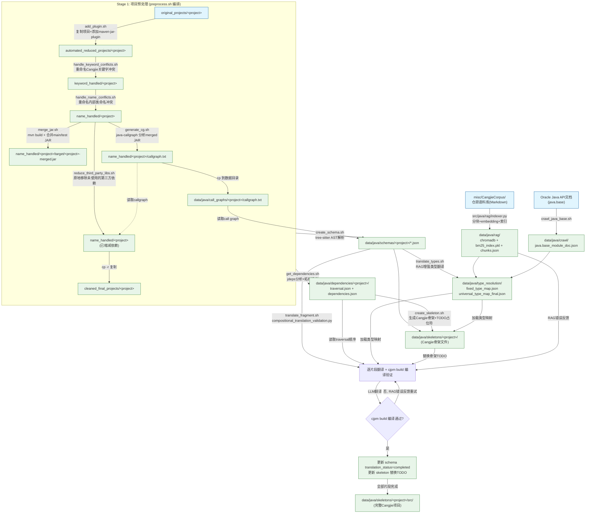

```mermaid
flowchart TD
    subgraph Stage1["Stage 1: 项目预处理 (preprocess.sh 编排)"]
        A1["original_projects/&lt;project&gt;"] -->|add_plugin.sh<br/>复制项目+添加maven-jar-plugin| A2["automated_reduced_projects/&lt;project&gt;"]
        A2 -->|handle_keyword_conflicts.sh<br/>重命名Cangjie关键字冲突| A3["keyword_handled/&lt;project&gt;"]
        A3 -->|handle_name_conflicts.sh<br/>重命名内部类命名冲突| A3b["name_handled/&lt;project&gt;"]
        A3b -->|merge_jar.sh<br/>mvn build + 合并main/test JAR| A4["name_handled/&lt;project&gt;/target/&lt;project&gt;-merged.jar"]
        A3b -->|generate_cg.sh<br/>java-callgraph 分析merged JAR| A5a["name_handled/&lt;project&gt;/callgraph.txt"]
        A5a -->|cp 到数据目录| A5b["data/java/call_graphs/&lt;project&gt;/callgraph.txt"]
        A3b -->|reduce_third_party_libs.sh<br/>原地移除未使用的第三方依赖| A5c["name_handled/&lt;project&gt;<br/>(已缩减依赖)"]
        A5a -..->|读取callgraph| A5c
        A5c -->|cp -r 复制| A6["cleaned_final_projects/&lt;project&gt;"]
    end

    Stage1 -->|create_schema.sh<br/>tree-sitter AST解析| C1["data/java/schemas/&lt;project&gt;/*.json"]
    A5b -->|读取call graph| C1
    Stage1 -->|get_dependencies.sh<br/>jdeps分析+拓扑排序| C2["data/java/dependencies/&lt;project&gt;/<br/>traversal.json + dependencies.json"]

    D1["misc/CangjieCorpus/<br/>仓颉语料库(Markdown)"] -->|src/java/rag/indexer.py<br/>分块+embedding+索引| D2["data/java/rag/<br/>chromadb + bm25_index.pkl + chunks.json"]
    D3["Oracle Java API文档<br/>(java.base)"] -->|crawl_java_base.sh| D4["data/java/crawl/<br/>java.base_module_doc.json"]

    C1 -->|translate_types.sh<br/>RAG增强类型翻译| E1["data/java/type_resolution/<br/>fixed_type_map.json<br/>universal_type_map_final.json"]
    D2 --> E1
    D4 --> E1

    C1 --> E2
    C2 -->|create_skeleton.sh<br/>生成Cangjie骨架+TODO占位符| E2["data/java/skeletons/&lt;project&gt;/<br/>(Cangjie骨架文件)"]
    E1 -->|加载类型映射| E2

    C1 -->|translate_fragment.sh<br/>compositional_translation_validation.py| F1["逐片段翻译 + cjpm build 编译验证"]
    C2 -->|读取traversal顺序| F1
    E1 -->|加载类型映射| F1
    E2 -->|替换骨架TODO| F1
    D2 -->|RAG错误反馈| F1
    F1 -->|LLM翻译| F2{"cjpm build 编译通过?"}
    F2 -->|否, RAG错误反馈重试| F1
    F2 -->|是| F3["更新 schema translation_status=completed<br/>更新 skeleton 替换TODO"]
    F3 -->|全部片段完成| F4["data/java/skeletons/&lt;project&gt;/src/<br/>(完整Cangjie项目)"]

    classDef input fill:#e1f5fe,stroke:#01579b
    classDef output fill:#e8f5e9,stroke:#2e7d32
    classDef stage fill:#fff3e0,stroke:#e65100

    class A1,D1,D3 input
    class A2,A3,A3b,A4,A5a,A5b,A5c,A6,C1,C2,D2,D4,E1,E2,F3,F4 output
```
